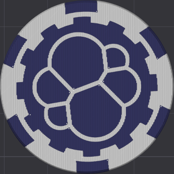
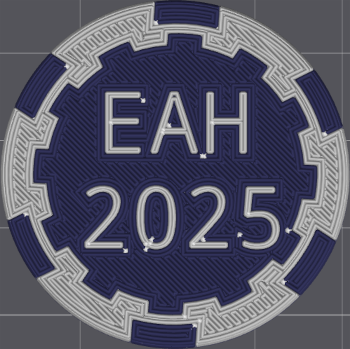

This year my wife gave me a 3D printer as a birthday gift, having it
on my background during meetings has sparked some interesting
conversations, and a colleague suggested I bring something for the
team, I like the idea right away and after some thinking I decided on
making a Maker Chip, inspired by [Zack
Freedman's](https://www.youtube.com/watch?v=B4bMm8w1rZY) video about
it.

Here I'll share all the resources I used as well as some photos/images
from the creation process.

If you want to print it, [here](EAH-2025-Text-Bottom-full-plate.3mf)
is the 3D model.

3D printing was not enough, I also had to put my Flipper Zero to some
good use, so I embedded a NFC tag that when scanned links to this
post. [Here](eah-2025-nfc-tag.nfc) is the Flipper NFC file.

## Images
Top View:

Bottom View:

## Resources
 - [Can I Design a Hole Project in Bambu
   Studio](https://www.youtube.com/watch?v=B4bMm8w1rZY): Spoiler
   alert, he designs a maker chip
 - [MakerChip - Maker Chip - The New Maker
   Coin](https://than.gs/m/1042339): Templates and guide
 - [Elastic Logo by RonFalafel](https://www.thingiverse.com/thing:4275230)
 - [Flipper Zero NFC Tag Generator](https://nfc.flippertools.net/)
